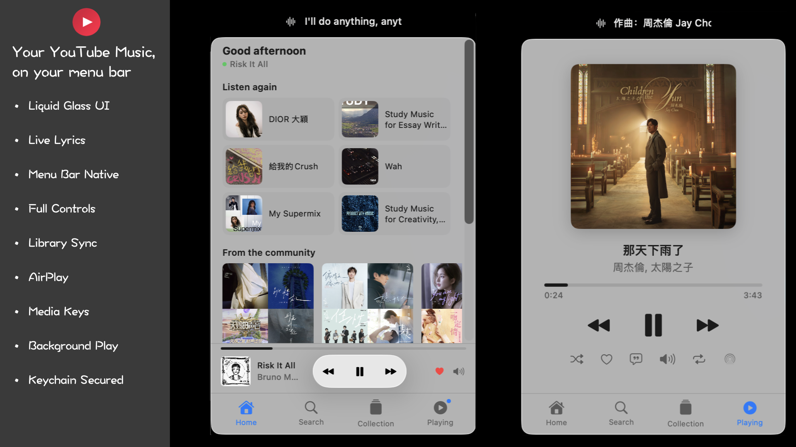

# 🎵 YouTube Music Bar

> YouTube Music，藏进你的 Mac 菜单栏。

🌐 [🇬🇧 English](../README.md) | [🇨🇳 中文](README_CN.md) | [🇯🇵 日本語](README_JP.md) | [🇰🇷 한국어](README_KR.md) | [🇫🇷 Français](README_FR.md) | [🇩🇪 Deutsch](README_DE.md) | [🇮🇹 Italiano](README_IT.md) | [🇪🇸 Español](README_ES.md)

<p align="center">
  
</p>

<p align="center">
  <em>首页推荐 & 正在播放 — 一切尽在小巧的浮动面板中</em>
</p>

---

YouTube Music Bar 是一款小巧的原生 macOS 应用，专为那些想让音乐触手可及、又不想占用浏览器标签页或 Dock 位置的人而设计。它静静地待在菜单栏，弹出一个紧凑的面板，完全不打扰你的工作。

点一下，选首歌，继续工作。✨

## ✨ 功能特性

- 🎵 **菜单栏常驻** — 驻留在 macOS 菜单栏，不占 Dock 位置，无需浏览器标签
- 🔍 **快速搜索** — 支持防抖搜索和筛选芯片，快速查找歌曲、专辑和播放列表
- 🏠 **首页推荐** — YouTube Music 的个性化推荐、混音和"再次收听"板块
- 📚 **曲库 & 喜欢的歌曲** — 浏览已保存的播放列表和喜欢的歌曲，支持分页加载
- 🎛️ **完整播放控制** — 播放、暂停、跳转、拖动、随机、循环、点赞 — 全部原生 macOS UI
- 📃 **播放队列** — 查看正在播放和即将播放的曲目
- 🎤 **同步歌词** — 专辑封面上逐行歌词叠加显示，点击任意行可跳转，LRCLib 备选
- 💬 **菜单栏歌词** — 当前歌词行在状态栏滚动显示，工作时也能看到
- 🎧 **媒体键支持** — 通过键盘媒体键和控制中心进行播放/暂停、上/下一首、拖动
- 📡 **AirPlay** — 内置选择器将音频输出到 AirPlay 设备
- 🔔 **切歌通知** — 切换曲目时弹出通知（可选）
- 🔊 **后台播放** — 关闭面板后音乐继续播放
- 🚀 **开机自启** — 登录时自动启动
- 🎨 **Liquid Glass 设计** — macOS Tahoe Liquid Glass 风格，旧系统优雅降级
- 🔐 **安全认证** — 通过 WebView 进行 Google 登录，Cookie 安全存储在 macOS 钥匙串中

## 📋 系统要求

- macOS 14 (Sonoma) 或更高版本
- 拥有 YouTube Music 访问权限的 [Google](https://accounts.google.com) 账号

## 📦 安装

### 下载

从 [**Releases**](https://github.com/user/YouTube-Music-Bar/releases) 页面下载最新的 `.dmg` 文件。

> **注意：** 这是一个未签名的应用。
> 如果 macOS 在移动到 `/Applications` 后阻止运行，请执行：
> ```bash
> xattr -cr "/Applications/YouTube Music Bar.app"
> ```

### 从源码构建

```bash
# 1. 克隆仓库
git clone https://github.com/user/YouTube-Music-Bar.git
cd YouTube-Music-Bar

# 2. 生成 Xcode 项目（需要 XcodeGen）
xcodegen

# 3. 打开并运行
open YouTubeMusicBar.xcodeproj
# 选择 YouTubeMusicBar 方案 → 运行 (⌘R)
```

完整的发布构建和 DMG 打包说明，请参阅 [RELEASE.md](../RELEASE.md)。

## 🏗️ 架构

```
YouTubeMusicBar/
├── App/            — 应用入口、AppDelegate、浮动面板、状态栏歌词视图
├── Models/         — Track、PlaybackState、Playlist、SearchResult
├── Services/       — PlayerService、AuthService、WebKitManager、API 客户端
│   └── API/        — YTMusicClient、APICache、解析器
├── Views/          — 首页、搜索、曲库、正在播放、歌词、队列、设置
├── Utilities/      — 常量
└── Resources/      — controls.js、observer.js、资源文件、Info.plist
```

**工作原理：**
1. 🔒 通过 WKWebView 中的 Google OAuth 登录 → Cookie 保存到钥匙串
2. 🎶 一个隐藏的 1×1 WKWebView 加载 YouTube Music 作为音频引擎
3. 📡 注入的 JavaScript 监听播放状态并将更新发送到 Swift
4. 🎯 原生 SwiftUI UI 通过 JS 函数调用控制播放
5. 🌐 YouTube Music 内部 API (`youtubei/v1`) 获取搜索、浏览、歌词和队列数据

## 🤝 参与贡献

欢迎贡献！随时提交 Issue 或 Pull Request。

## ⚠️ 免责声明

YouTube Music Bar 是一款**非官方**应用，与 YouTube 或 Google **没有任何关联**。
"YouTube"、"YouTube Music" 和 "YouTube Logo" 是 Google Inc. 的注册商标。
